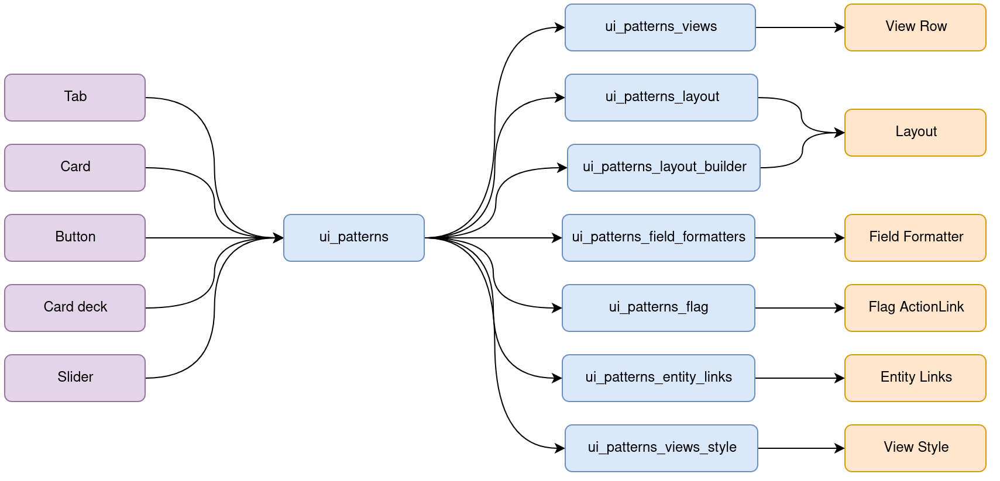

# Drupal GovCon 2024 UI Patterns

> Define and expose self-contained UI patterns as Drupal plugins and use them seamlessly in Drupal development and
> site-building.
>
> Also called "components", UI patterns are reusable, nestable, guided by clear standards, and can be assembled
> together to build any number of applications.

## Table of contents

* [Setup](#setup)
* [Resources](#resources)

## Setup 

1. Clone repo
2. Run `ddev start`
3. Run `ddev composer install`
4. Run `ddev import-db --file drupal-govcon-demo-db.sql.gz`

## Resources 

### Ui Suite

* https://www.drupal.org/project/ui_suite
* https://www.drupal.org/project/ui_patterns
* https://www.drupal.org/docs/contributed-modules/ui-patterns/welcome-to-ui-patterns-documentation

### Ui Suite USWDS

* https://www.drupal.org/project/ui_suite_uswds
* https://www.drupal.org/project/ui_suite_uswds_paragraphs
* https://www.drupal.org/project/ui_suite_uswds_extras

### Single Directory Components

* https://www.drupal.org/docs/develop/theming-drupal/using-single-directory-components
* https://www.drupal.org/docs/develop/theming-drupal/using-single-directory-components/frequently-asked-questions
